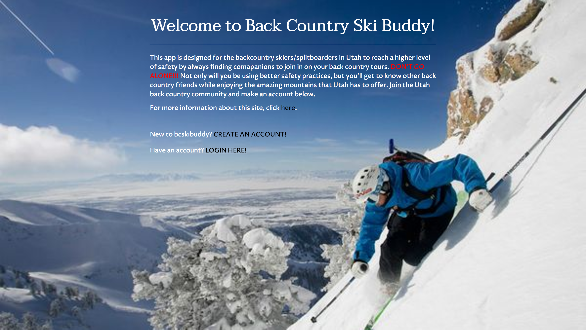
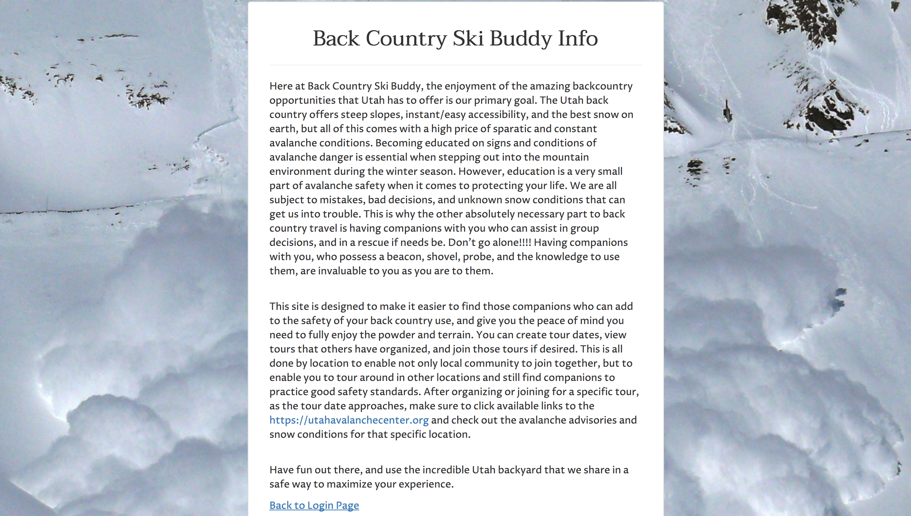
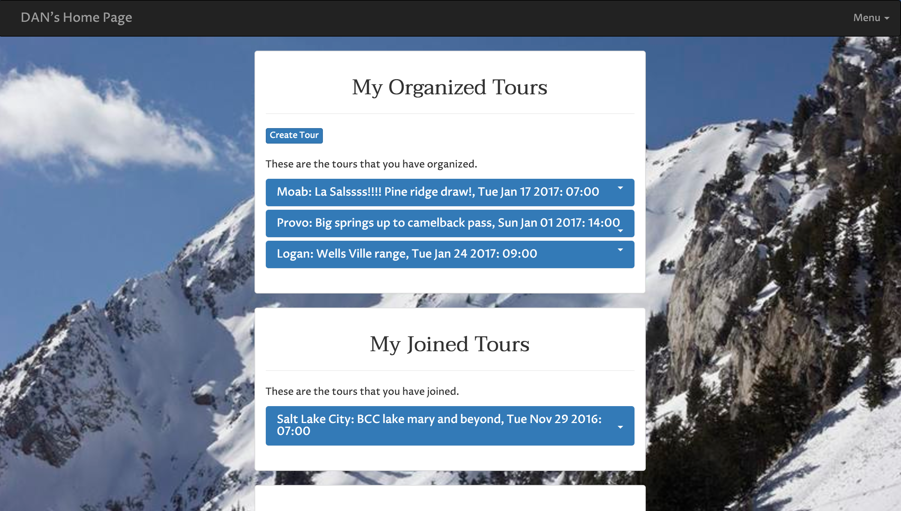

BCSKIBUDDY
==========
This is an app to find back country ski companions in your area specifically for the state of Utah.
This is meant to improve the safety of individuals accessing the backcountry and to grow the community.

Summary
-------
As a user, after creating a profile, this app will give you access to the community of back country
users in Utah.  On your home page, you can look up tours that other users have created and join them.  
After joining them, you can join the conversation of that individual trip by adding comments.  
If you wish to create a trip in a specific area, you can do so which will enable other users to join your trip.  With these methods, you will be able to access the back country with companions who can assist in group decisions and in avalanche/injury rescues if needs be.  

Live Site
---------
BCSKIBUDDY can be accessed at https://calm-meadow-29295.herokuapp.com/

Features
--------
|  |  |  |
|:---:|:---:|:---:|
| Landing Page | Info Page | Home Page |
- Create Profile
- Create Tour
- Find Tours in Specific Location
- Join Tours

Technology
----------
- [Node](https://nodejs.org)
- This app was designed to specifically target nodejs technologies.
- Front end was made with bootstrap and jquery.
- Back end included express, mongoosejs, passport, body-parser.
- Development tools include mocha, chai, and chai http.

Future Directions
-----------------

