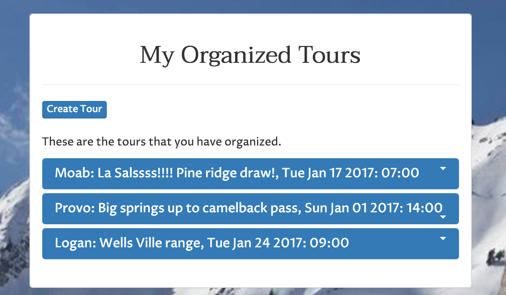
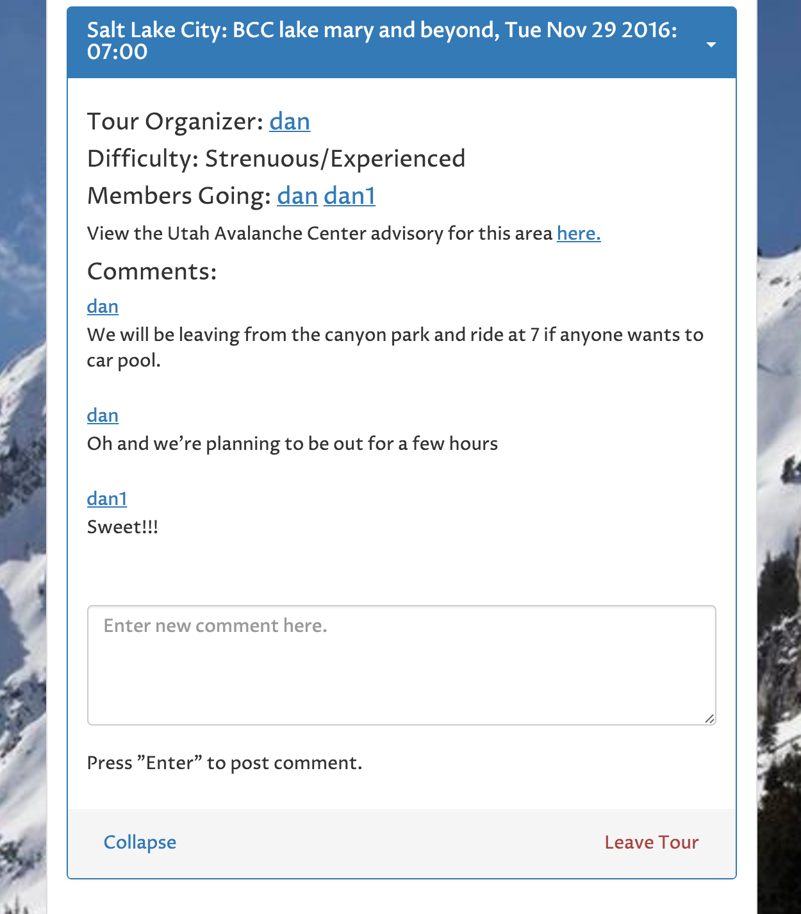
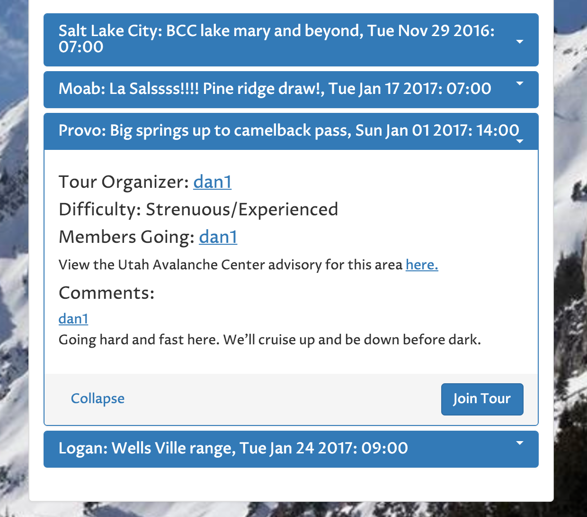

BCSKIBUDDY
==========
This is an app to find back country ski companions in your area specifically for the state of Utah.
This is meant to improve the safety of individuals accessing the backcountry and to grow the community.

Summary
-------
As a user, after creating a profile, this app will give you access to the community of back country
users in Utah.  On your home page, you can look up tours that other users have created and join them.  
After joining them, you can join the conversation of that individual trip by adding comments.  
If you wish to create a trip in a specific area, you can do so which will enable other users to join your trip.  With these methods, you will be able to access the back country with companions who can assist in group decisions and in avalanche/injury rescues if needs be.  

Live Site
---------
BCSKIBUDDY can be accessed at https://calm-meadow-29295.herokuapp.com/

Features
--------
|  |  |  |
|:---:|:---:|:---:|
| Landing Page | Info Page | Home Page |

The basic design consists of landing, information, and home pages.  Most of the functionality of the app takes place after you have logged into your home page.  At this point you can access and edit your profile, and you can move between three panels that diplay either your organized tours, your joined tours, and scheduled tours that others have created.  These are each displayed below. 

|  |  |  |
|:---:|:---:|:---:|
| Organized Tours | Joined Tours | Upcoming Tours |

With each of these panels, you have the option to organize as many tours as you want, and join as many tours as you want.  Once a tour is organized or joined, there is a running comment feed that can be used for planning tour details or other conversation.  You also have the option to leave tours as well.

Technology
----------
- [Node](https://nodejs.org)
- This app was designed to specifically target nodejs technologies.
- Front end was made with bootstrap and jquery.
- Back end included express, mongoosejs, passport, body-parser.
- Development tools include mocha, chai, and chai http.

Future Directions
-----------------

